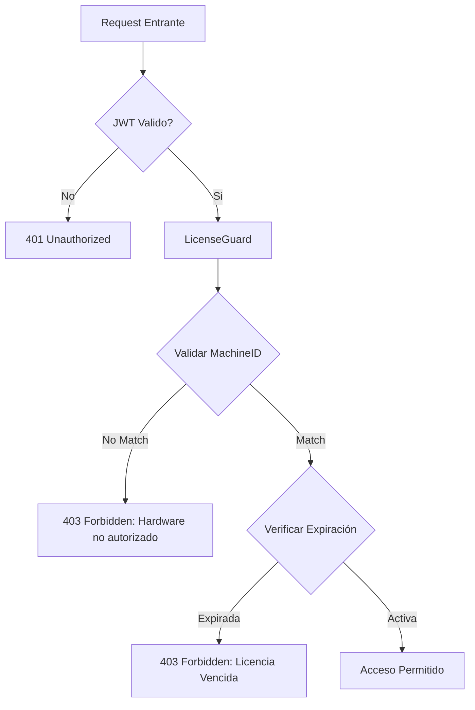

# 📘 Manual de Arquitectura y Estándares Técnicos: VetSaaS

Este documento define los estándares de ingeniería, patrones de diseño y protocolos de seguridad aplicados en el ecosistema VetSaaS (NestJS + Angular + Electron).

---

## 🏛️ 1. Estructura de Software (Clean Architecture)

Para garantizar la separación de responsabilidades, cada módulo debe seguir estrictamente esta organización de archivos:

* **`nombre.module.ts`**: Corazón del módulo. Define inyecciones, controladores y proveedores.
* **`nombre.controller.ts`**: Capa de entrada. Solo gestiona rutas, decoradores de Swagger y recibe DTOs. **No contiene lógica de negocio.**
* **`nombre.service.ts`**: Capa de lógica. Aquí reside la "inteligencia" del sistema, validaciones complejas y llamadas a la base de datos.
* **`dto/`**: Objetos de transferencia de datos con validación inyectada.
* **`entities/`**: Modelos de TypeORM que representan las tablas en la base de datos.

---

## 🛠️ 2. Estándar de DTOs (Data Transfer Objects)

El DTO es el contrato entre el cliente y el servidor. Su función es triple: **Validar, Tipar y Documentar.**

### Reglas de Oro
1. **Inmutabilidad**: Uso obligatorio de `readonly` para evitar efectos secundarios.
2. **Single Responsibility**: Un DTO para cada acción (ej. diferenciar Create de Update).
3. **Anatomía del Decorador**:
   - 1. Swagger (`@ApiProperty`)
   - 2. Validación (`@IsString`, `@IsInt`, etc.)
   - 3. Transformación (`@Type`)

### Ejemplo Maestro: `CreatePetDto`
```typescript
export class CreatePetDto {
  @ApiProperty({ description: 'Nombre de la mascota' })
  @IsString()
  @MinLength(2)
  readonly name: string;

  @ApiProperty({ enum: PetSpecies })
  @IsEnum(PetSpecies)
  readonly species: PetSpecies;

  @ApiProperty({ description: 'ID del dueño (UUID)' })
  @IsUUID('4')
  readonly ownerId: string;
}

---

## 🔐 3. Seguridad y Multi-Tenancy (JWT)

El sistema utiliza un modelo de **Aislamiento Lógico** basado en el Tenant ID para gestionar múltiples clínicas veterinarias de forma segura.

* **JWT Payload**: El token es el motor del Multi-Tenancy. Debe incluir obligatoriamente:
    * `sub`: ID único del usuario.
    * `orgId`: ID de la organización (clave para filtrar todas las consultas SQL).
* **Seguridad de Credenciales**: Uso de `bcrypt` con un **Salt de 10 rondas**. Se automatiza mediante el hook `@BeforeInsert()` en la entidad `User` para garantizar que ninguna contraseña se almacene en texto plano.
* **Filtrado Estricto**: Todo servicio que interactúe con la base de datos debe recibir el `orgId` desde el Request y aplicarlo como filtro en los Repositorios de TypeORM.

---

## 🛡️ 4. Módulo de Licenciamiento (LicenseGuard)

Este módulo protege la propiedad intelectual y controla el acceso según el plan contratado o el hardware autorizado (especialmente en la versión **Electron**).

### Flujo de Validación de Licencia


* **Hardware Binding**: Se utiliza un `HardwareService` especializado para vincular la licencia al ID único de la placa base/procesador del cliente.
* **Planes Soportados**:
    * `LIFETIME`: Vinculación estricta y permanente a un `machineId` específico.
    * `SUBSCRIPTION`: Validación basada en estados activos y fechas de expiración temporales.

---

## 💾 5. Persistencia y Resiliencia de Datos

### Gestión de Base de Datos
* **Migraciones**: Se prohíbe estrictamente el uso de `synchronize: true`. Cada cambio estructural debe estar documentado en una migración atómica (archivos `.ts` en `src/db/migrations`).
* **Atomicidad**: Cada archivo de migración debe representar un único cambio lógico significativo para facilitar el *rollback* en caso de errores.

### Sistema de Backups (Disaster Recovery)
* **Automatización**: Tareas programadas mediante `@Cron` que se ejecutan diariamente a las **00:00 AM**.
* **Política de Retención**: El motor de rotación mantiene únicamente los últimos **7 respaldos**, eliminando el más antiguo automáticamente para optimizar el almacenamiento local.
* **Respaldo Manual**: Endpoint disponible vía `POST /backups/manual` para acciones preventivas antes de actualizaciones críticas.

---

## 🆘 6. Solución de Problemas y Restauración

### Troubleshooting Común

| Problema | Causa | Solución |
| :--- | :--- | :--- |
| **Hardware no autorizado** | Cambio de componentes físicos o migración a nueva PC. | Actualizar el `machineId` en la DB tras verificar la identidad del cliente. |
| **Fallo en Backups** | Permisos de carpeta insuficientes o disco lleno. | Revisar cuotas de disco y permisos de escritura del proceso de Node.js. |
| **Bloqueo Global de Rutas** | Payload JWT malformado o ausencia de `orgId`. | Verificar la lógica de firma de tokens en el `AuthService`. |

### Procedimiento de Restauración
1.  **Detener** el servidor NestJS para evitar bloqueos de archivo.
2.  **Renombrar** la base de datos dañada: `database.sqlite` → `database.sqlite.old`.
3.  **Seleccionar** el backup más reciente dentro de la carpeta `/backups`.
4.  **Copiar y renombrar** dicho backup como `database.sqlite` en la raíz del proyecto.
5.  **Reiniciar** el servidor y validar logs de inicio.

---

## ✅ Checklist de Calidad (Pull Requests)
- [ ] ¿Los campos del DTO son `readonly`?
- [ ] ¿La migración incluye el método `down` para reversión?
- [ ] ¿Se inyectó el `orgId` en todas las consultas al repositorio?
- [ ] ¿La documentación de Swagger refleja fielmente los nuevos endpoints?